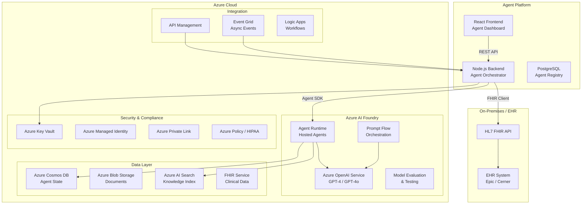
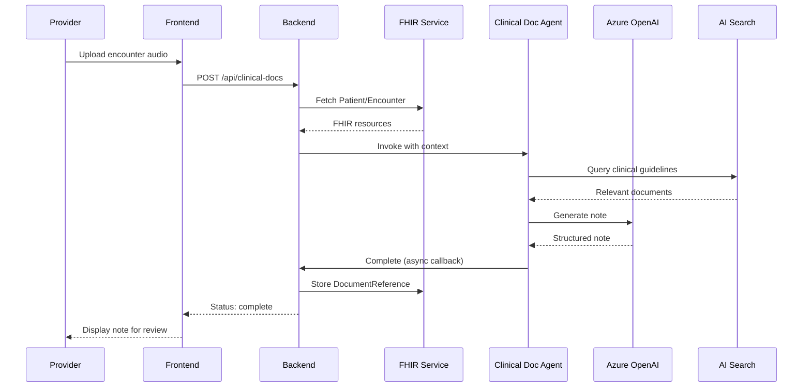
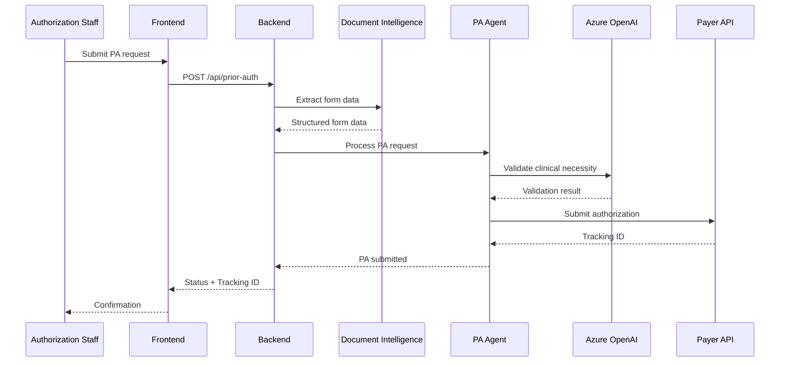
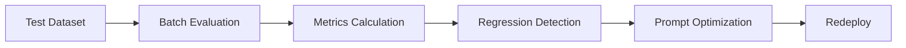

# Azure Healthcare Agentic AI Platform - Design Plan

## Executive Summary

This design plan outlines the architecture for an agentic AI platform built on Azure AI Foundry, targeting two primary healthcare use cases:

1. **Clinical Documentation Agent** - Automates clinical note generation, summarization, and coding suggestions
2. **Prior Authorization Agent** - Automates insurance prior authorization request processing and status tracking

## Current State Analysis

### Existing Infrastructure

- **Frontend**: React + TypeScript (port 3001)
- **Backend**: Node.js + Express + TypeScript (port 5000)
- **Database**: PostgreSQL (port 5432)
- **Containerization**: Docker Compose
- **Cloud**: Azure ecosystem (healthcare company)

### Gaps for Production Healthcare AI

- No Azure AI Foundry integration
- No LLM/model deployment infrastructure
- No HIPAA-compliant security controls
- No agent orchestration framework
- No evaluation/monitoring pipeline
- No healthcare-specific data connectors (EHR, FHIR)

---

## Target Architecture

### High-Level System Diagram



---

## Component Design

### 1. Azure AI Foundry Project Setup

**Resource Group**: `rg-healthcare-ai-{env}`
**Project**: `healthcare-agentic-platform`
**Region**: `canadacentral` (healthcare data residency)

**Required Azure Resources**:
| Resource | Purpose | SKU |
|----------|---------|-----|
| Azure AI Services | Multi-service AI resource | S0 |
| Azure OpenAI | LLM inference | Standard |
| Azure AI Foundry Project | Agent hosting & management | - |
| Azure Container Registry | Agent container images | Standard |
| Azure Cosmos DB | Agent state & conversation history | Serverless |
| Azure Blob Storage | Document storage | Standard LRS |
| Azure AI Search | Knowledge retrieval | Basic |

### 2. Agent Types & Architecture

#### Agent 1: Clinical Documentation Agent

**Type**: Hosted Agent (container-based)
**Framework**: LangChain / Semantic Kernel
**Protocol**: `invocations` (async processing)

**Capabilities**:

- Ingest clinical encounter transcripts (audio/text)
- Generate structured clinical notes (SOAP format)
- Suggest ICD-10 / CPT codes
- Extract medication lists and allergies
- Summarize patient history from FHIR resources

**Input**:

- Audio transcript (via Azure Speech-to-Text)
- FHIR Patient resource
- FHIR Encounter resource

**Output**:

- Structured clinical note (JSON / FHIR DocumentReference)
- Suggested billing codes
- Confidence scores

**Knowledge Sources**:

- Medical terminology index (Azure AI Search)
- Clinical guidelines (Blob Storage + AI Search)
- Organization-specific documentation templates

#### Agent 2: Prior Authorization Agent

**Type**: Prompt Agent (LLM-based)
**Model**: GPT-4o
**Protocol**: `responses` (synchronous)

**Capabilities**:

- Parse prior authorization forms
- Check payer-specific requirements
- Validate clinical necessity against guidelines
- Generate authorization request packages
- Track status and escalate denials

**Input**:

- PA form (PDF/image via Azure Document Intelligence)
- Patient clinical summary (FHIR)
- Payer rules (knowledge base)

**Output**:

- Completed PA form
- Supporting clinical documentation
- Status tracking ID

### 3. Data Flow Architecture

#### Clinical Documentation Flow



#### Prior Authorization Flow



### 4. Security & HIPAA Compliance

#### Network Security

- **Azure Private Link**: All Azure services accessed via private endpoints
- **VNet Integration**: Agent containers in isolated subnet
- **NSG Rules**: Restrict outbound to required endpoints only

#### Data Protection

- **Encryption at Rest**: Azure Storage Service Encryption (SSE)
- **Encryption in Transit**: TLS 1.3 for all communications
- **Key Management**: Azure Key Vault with HSM-backed keys
- **PHI Handling**: Azure Customer Lockbox for Microsoft access

#### Identity & Access

- **Authentication**: Azure AD + Managed Identity
- **Authorization**: RBAC with healthcare-specific roles
  - `Clinical Documentation Agent User`
  - `Prior Authorization Agent User`
  - `Agent Administrator`
  - `Compliance Officer`
- **Audit Logging**: Azure Monitor + Azure Log Analytics

#### Compliance Controls

| Control         | Implementation                         |
| --------------- | -------------------------------------- |
| Access Logging  | Azure Diagnostic Settings              |
| Data Retention  | Azure Policy (7-year retention)        |
| PHI Masking     | Azure AI Language PII detection        |
| BAA             | Microsoft Business Associate Agreement |
| Risk Assessment | Azure Security Center                  |

### 5. Agent Orchestration Layer

The existing Node.js backend will be enhanced to serve as the **Agent Orchestration Layer**:

**Responsibilities**:

- Agent lifecycle management (create, deploy, scale)
- Request routing to appropriate agent
- FHIR resource mapping
- Authentication/authorization
- Audit logging
- Result caching

**New API Endpoints**:

```typescript
// Agent Management
POST   /api/agents              // Register new agent
GET    /api/agents              // List agents
GET    /api/agents/:id          // Get agent details
DELETE /api/agents/:id          // Decommission agent

// Clinical Documentation
POST   /api/clinical-docs       // Submit documentation request
GET    /api/clinical-docs/:id   // Get documentation status
PUT    /api/clinical-docs/:id   // Update/review note

// Prior Authorization
POST   /api/prior-auth          // Submit PA request
GET    /api/prior-auth/:id      // Get PA status
POST   /api/prior-auth/:id/appeal // Submit appeal

// Monitoring
GET    /api/metrics/agents      // Agent performance metrics
GET    /api/audit/logs          // Audit trail
```

### 6. Knowledge Management

**Azure AI Search Index Structure**:

```json
{
  "indexName": "clinical-knowledge",
  "fields": [
    { "name": "id", "type": "Edm.String", "key": true },
    { "name": "content", "type": "Edm.String", "searchable": true },
    { "name": "documentType", "type": "Edm.String", "filterable": true },
    { "name": "specialty", "type": "Edm.String", "filterable": true },
    { "name": "lastUpdated", "type": "Edm.DateTimeOffset", "sortable": true }
  ]
}
```

**Document Types**:

- Clinical guidelines (specialty-specific)
- Payer policies and rules
- Organization documentation templates
- ICD-10 / CPT code references

### 7. Evaluation & Testing Strategy

#### Automated Evaluation Pipeline



**Evaluation Metrics**:
| Metric | Target | Measurement |
|--------|--------|-------------|
| Clinical Note Accuracy | > 95% | Clinician review |
| Code Suggestion Precision | > 90% | Coding audit |
| PA Approval Rate | > 85% | Payer response |
| Response Latency | < 5s | API monitoring |
| PHI Detection Recall | > 99% | Synthetic data tests |

**Test Datasets**:

- Synthetic clinical encounters (Synthea-generated)
- De-identified historical PA requests
- Adversarial PHI injection tests

### 8. Monitoring & Observability

**Azure Monitor Setup**:

- Application Insights for agent telemetry
- Log Analytics for audit logs
- Custom dashboards for agent performance
- Alerting for error rates and latency

**Key Metrics**:

- Agent invocation count and success rate
- Token consumption and cost
- FHIR API call latency
- PHI detection events
- User satisfaction scores

---

## Implementation Roadmap

### Phase 1: Foundation (Weeks 1-4)

- [ ] Provision Azure AI Foundry project
- [ ] Deploy Azure OpenAI models (GPT-4o)
- [ ] Set up Azure AI Search and index clinical knowledge
- [ ] Configure Azure Key Vault and Managed Identity
- [ ] Implement VNet and Private Link
- [ ] Update backend with Azure SDK integration

### Phase 2: Clinical Documentation Agent (Weeks 5-8)

- [ ] Develop hosted agent container
- [ ] Integrate Azure Speech-to-Text
- [ ] Build FHIR connector
- [ ] Implement note generation pipeline
- [ ] Create clinician review UI
- [ ] Run evaluation against test dataset

### Phase 3: Prior Authorization Agent (Weeks 9-12)

- [ ] Develop prompt-based PA agent
- [ ] Integrate Azure Document Intelligence
- [ ] Build payer rules knowledge base
- [ ] Implement PA submission workflow
- [ ] Create status tracking dashboard
- [ ] Run evaluation against historical data

### Phase 4: Production Hardening (Weeks 13-16)

- [ ] Implement comprehensive audit logging
- [ ] Set up monitoring and alerting
- [ ] Conduct security review and penetration testing
- [ ] Perform HIPAA compliance validation
- [ ] Load testing and performance optimization
- [ ] Disaster recovery and backup testing

### Phase 5: Rollout & Optimization (Weeks 17-20)

- [ ] Pilot with select providers
- [ ] Gather feedback and iterate
- [ ] Scale to broader organization
- [ ] Continuous evaluation and prompt optimization
- [ ] Cost optimization review

---

## Technology Stack

| Layer      | Technology                                     |
| ---------- | ---------------------------------------------- |
| Frontend   | React 19, TypeScript, Azure AD MSAL            |
| Backend    | Node.js 20, Express, Azure SDK                 |
| Agents     | Azure AI Foundry, LangChain, Semantic Kernel   |
| LLM        | Azure OpenAI GPT-4o                            |
| Database   | PostgreSQL (agent registry), Cosmos DB (state) |
| Search     | Azure AI Search                                |
| Storage    | Azure Blob Storage                             |
| Speech     | Azure Speech-to-Text                           |
| Documents  | Azure Document Intelligence                    |
| Monitoring | Azure Monitor, Application Insights            |
| Security   | Azure AD, Key Vault, Private Link              |
| IaC        | Terraform / Bicep                              |

---

## Risk Mitigation

| Risk                    | Mitigation                                          |
| ----------------------- | --------------------------------------------------- |
| PHI Exposure            | PII detection, data masking, private endpoints      |
| Model Hallucination     | Human-in-the-loop, confidence thresholds, citations |
| Payer API Changes       | Abstraction layer, fallback workflows               |
| Regulatory Changes      | Compliance monitoring, policy-as-code               |
| Performance Degradation | Caching, async processing, scaling rules            |

---

## Next Steps

1. **Review and approve** this design plan
2. **Provision Azure resources** using Terraform/Bicep templates
3. **Set up Azure AI Foundry** project and deploy initial models
4. **Begin Phase 1 implementation** with backend Azure SDK integration
5. **Schedule security review** with compliance team
