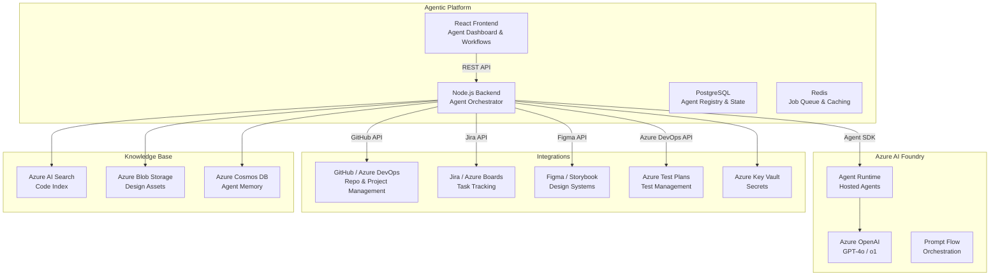
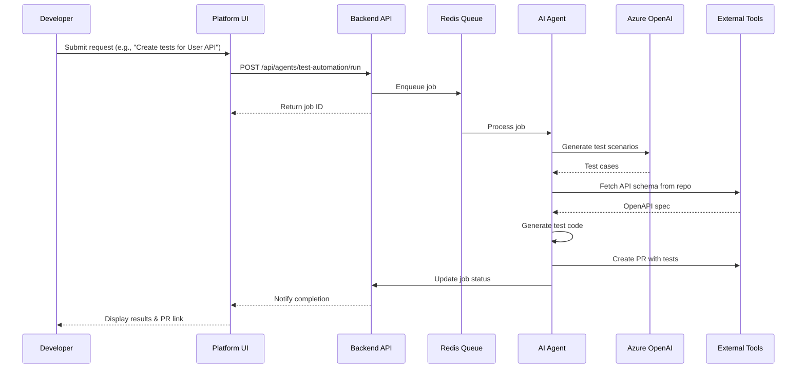

# SDL Agentic AI Platform - Design Plan

## Executive Summary

This platform leverages Azure AI Foundry to automate and enhance the Software Development Lifecycle (SDL) through specialized AI agents. Rather than replacing human developers, these agents act as intelligent assistants that accelerate delivery, improve quality, and reduce manual overhead across the entire development pipeline.

## Target Agent Ecosystem

### 1. Requirements Optimization Agent

**Purpose**: Transform raw business requirements into structured, actionable development specifications

**Capabilities**:

- Parse unstructured requirements documents, emails, meeting transcripts
- Identify ambiguities, contradictions, and missing acceptance criteria
- Generate structured user stories with Gherkin-style acceptance criteria
- Suggest edge cases and non-functional requirements
- Create requirement traceability matrices
- Validate requirements against existing system capabilities

**Input**: Raw requirement text, existing system documentation, stakeholder interviews
**Output**: Structured user stories, acceptance criteria, requirement gaps analysis

### 2. Sprint & Task Management Agent

**Purpose**: Intelligent project planning and task decomposition

**Capabilities**:

- Decompose epics into sprint-sized tasks with effort estimates
- Analyze team velocity and capacity for sprint planning
- Identify task dependencies and critical paths
- Suggest optimal sprint scope based on historical data
- Generate sprint retrospectives insights
- Auto-assign tasks based on team member expertise and workload

**Input**: Epic descriptions, team capacity, historical sprint data
**Output**: Sprint backlog, task breakdowns, dependency graphs, risk assessments

### 3. Test Automation Agent

**Purpose**: Generate comprehensive test suites from requirements and code

**Capabilities**:

- Generate unit tests from code analysis
- Create integration test scenarios from API contracts
- Produce end-to-end test flows from user stories
- Identify untested code paths and edge cases
- Generate test data and mock fixtures
- Create visual regression test baselines from designs
- Suggest performance test scenarios

**Input**: Source code, API specs, user stories, design prototypes
**Output**: Test cases, test scripts, mock data, coverage reports

### 4. Mock & Prototype Generation Agent

**Purpose**: Accelerate UI/UX development with AI-generated mocks and prototypes

**Capabilities**:

- Generate UI mockups from text descriptions and existing design systems
- Create interactive prototypes from wireframes
- Suggest responsive layouts and accessibility improvements
- Generate component code from design tokens
- Create storybook stories from components
- Produce design documentation and style guides

**Input**: Design descriptions, existing component library, brand guidelines
**Output**: HTML/CSS mocks, React/Vue components, Figma-like prototypes, Storybook files

### 5. Code Review & Quality Agent

**Purpose**: Automated code review and quality assurance

**Capabilities**:

- Analyze code for security vulnerabilities
- Check compliance with coding standards
- Suggest refactoring opportunities
- Identify performance bottlenecks
- Generate documentation from code
- Validate API contract compliance

**Input**: Pull requests, codebase, coding standards
**Output**: Review comments, security reports, refactoring suggestions

### 6. Documentation Agent

**Purpose**: Maintain comprehensive and up-to-date project documentation

**Capabilities**:

- Generate API documentation from OpenAPI specs
- Create architecture decision records (ADRs)
- Produce user guides from feature descriptions
- Maintain changelog and release notes
- Generate onboarding documentation
- Create runbooks for operational procedures

**Input**: Code changes, API specs, architecture diagrams, meeting notes
**Output**: Markdown docs, API docs, runbooks, ADRs

---

## System Architecture



---

## Agent Orchestration Flow



---

## API Design

### Agent Management

```
GET    /api/agents                    # List all agents
GET    /api/agents/:id                # Get agent details
POST   /api/agents/:id/run            # Execute agent task
GET    /api/agents/:id/jobs           # List agent jobs
GET    /api/agents/:id/jobs/:jobId    # Get job status
```

### Requirements Agent

```
POST   /api/requirements/optimize     # Optimize raw requirements
POST   /api/requirements/stories      # Generate user stories
POST   /api/requirements/gaps         # Identify requirement gaps
```

### Sprint Agent

```
POST   /api/sprints/plan              # Generate sprint plan
POST   /api/sprints/decompose         # Decompose epic into tasks
POST   /api/sprints/analyze           # Analyze sprint health
```

### Test Automation Agent

```
POST   /api/tests/generate            # Generate tests from code
POST   /api/tests/generate-from-spec  # Generate tests from API spec
POST   /api/tests/coverage            # Analyze test coverage
POST   /api/tests/mocks               # Generate mock data
```

### Mock Generation Agent

```
POST   /api/mocks/generate            # Generate UI mocks
POST   /api/mocks/prototype           # Create interactive prototype
POST   /api/mocks/components          # Generate component code
```

### Code Review Agent

```
POST   /api/review/analyze            # Analyze PR
POST   /api/review/security           # Security scan
POST   /api/review/performance        # Performance analysis
```

---

## Data Model

### Agents Table

```sql
CREATE TABLE agents (
    id SERIAL PRIMARY KEY,
    name VARCHAR(255) NOT NULL,
    type VARCHAR(50) NOT NULL, -- requirements, sprint, test, mock, review, docs
    status VARCHAR(50) DEFAULT 'active',
    description TEXT,
    capabilities JSONB DEFAULT '[]',
    config JSONB DEFAULT '{}',
    last_ping TIMESTAMP DEFAULT CURRENT_TIMESTAMP,
    created_at TIMESTAMP DEFAULT CURRENT_TIMESTAMP
);
```

### Jobs Table

```sql
CREATE TABLE agent_jobs (
    id SERIAL PRIMARY KEY,
    agent_id INTEGER REFERENCES agents(id),
    job_type VARCHAR(100) NOT NULL,
    status VARCHAR(50) DEFAULT 'pending', -- pending, running, completed, failed
    input JSONB NOT NULL,
    output JSONB,
    logs TEXT[],
    started_at TIMESTAMP,
    completed_at TIMESTAMP,
    created_at TIMESTAMP DEFAULT CURRENT_TIMESTAMP
);
```

### Projects Table

```sql
CREATE TABLE projects (
    id SERIAL PRIMARY KEY,
    name VARCHAR(255) NOT NULL,
    repo_url VARCHAR(500),
    jira_project_key VARCHAR(50),
    figma_file_key VARCHAR(100),
    config JSONB DEFAULT '{}',
    created_at TIMESTAMP DEFAULT CURRENT_TIMESTAMP
);
```

---

## Implementation Phases

### Phase 1: Foundation (Weeks 1-3)

- [ ] Set up Azure AI Foundry project
- [ ] Deploy Azure OpenAI models
- [ ] Build agent orchestration backend
- [ ] Create basic React dashboard
- [ ] Implement job queue with Redis

### Phase 2: Requirements & Sprint Agents (Weeks 4-6)

- [ ] Build Requirements Optimization Agent
- [ ] Build Sprint & Task Management Agent
- [ ] Integrate with Jira/Azure Boards
- [ ] Create requirements UI workflow
- [ ] Create sprint planning UI

### Phase 3: Test Automation Agent (Weeks 7-9)

- [ ] Build Test Generation Agent
- [ ] Integrate with GitHub/Azure DevOps
- [ ] Support multiple test frameworks (Jest, Pytest, etc.)
- [ ] Create test generation UI
- [ ] Implement coverage analysis

### Phase 4: Mock Generation Agent (Weeks 10-12)

- [ ] Build Mock Generation Agent
- [ ] Integrate with Figma API
- [ ] Generate React/Vue components
- [ ] Create mock generation UI
- [ ] Support design system integration

### Phase 5: Code Review & Docs Agents (Weeks 13-15)

- [ ] Build Code Review Agent
- [ ] Build Documentation Agent
- [ ] Integrate with GitHub PR workflow
- [ ] Create review UI
- [ ] Auto-generate documentation

### Phase 6: Production Hardening (Weeks 16-18)

- [ ] Implement comprehensive logging
- [ ] Add monitoring and alerting
- [ ] Performance optimization
- [ ] Security review
- [ ] Load testing

---

## Technology Stack

| Layer      | Technology                            |
| ---------- | ------------------------------------- |
| Frontend   | React 19, TypeScript, Tailwind CSS    |
| Backend    | Node.js 20, Express, Azure SDK        |
| AI         | Azure OpenAI GPT-4o, Azure AI Foundry |
| Queue      | Redis (Bull MQ)                       |
| Database   | PostgreSQL                            |
| Cache      | Redis                                 |
| Search     | Azure AI Search                       |
| Storage    | Azure Blob Storage                    |
| Monitoring | Azure Monitor, Application Insights   |
| IaC        | Terraform                             |

---

## Success Metrics

| Metric                     | Target          |
| -------------------------- | --------------- |
| Requirements clarity score | > 90%           |
| Test coverage generation   | > 80%           |
| Sprint planning accuracy   | > 85%           |
| Mock generation acceptance | > 75%           |
| Code review issues found   | > 50% automated |
| Documentation freshness    | Real-time       |
| Agent response time        | < 30s           |
